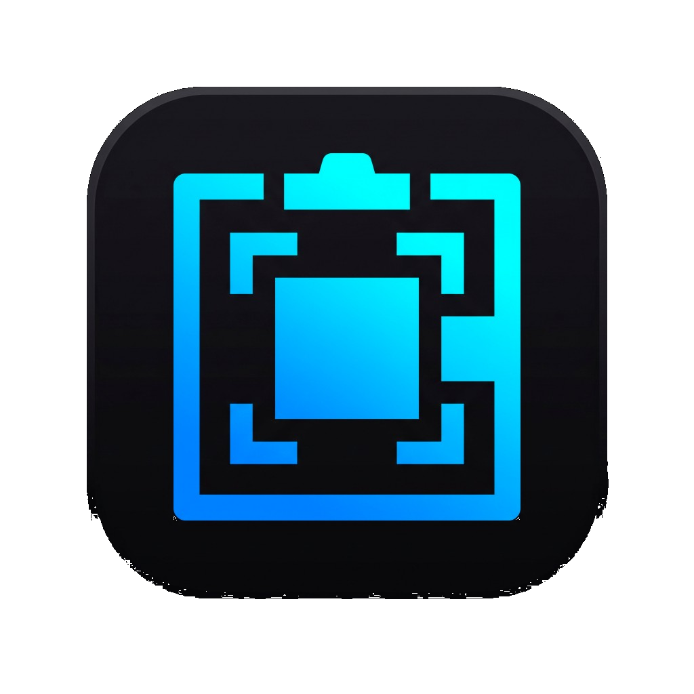
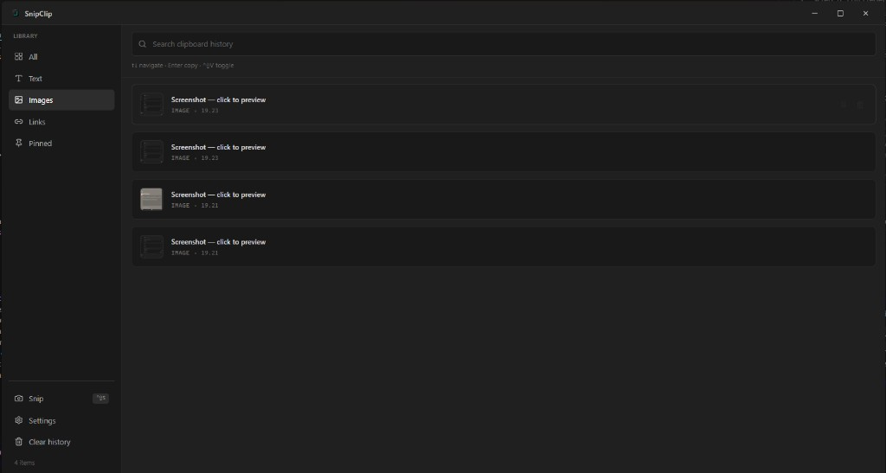
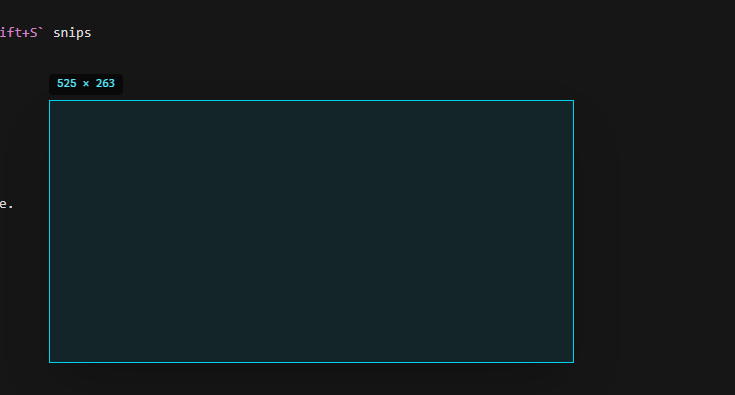
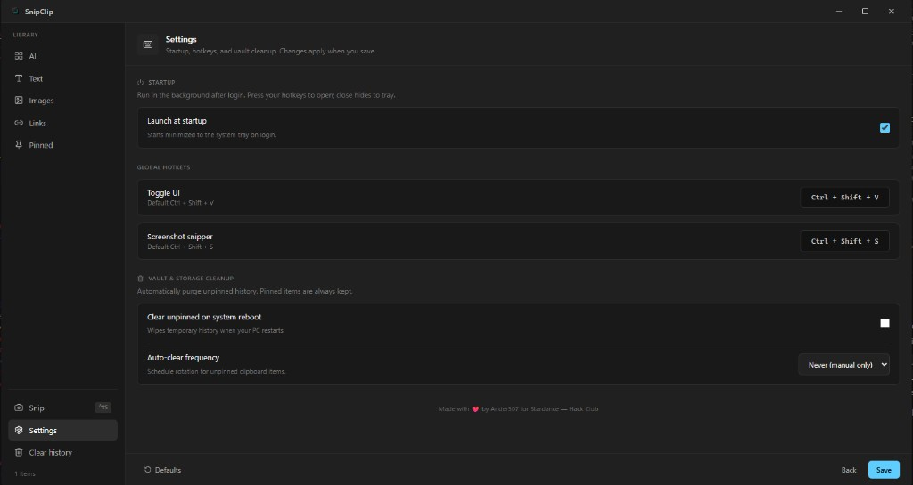
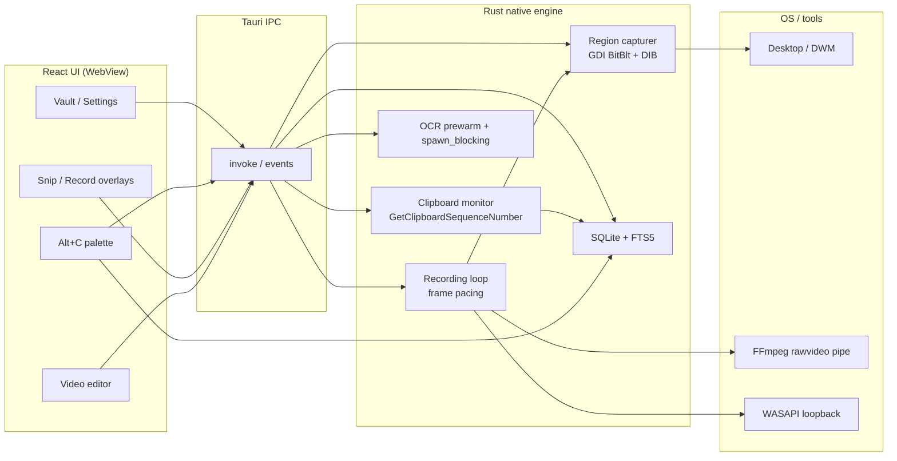

# SnipClip

One tray app for clipboard history, screenshots, screen recording, OCR, and in-app video trim — private, local, and fast.

<p align="center">
  
</p>

<p align="center">
  
</p>

<p align="center">
  <a href="https://github.com/Ander507/SnipClip/releases/latest"></a>
</p>

<p align="center">
  <strong><a href="https://github.com/Ander507/SnipClip/releases/latest">Download the latest release</a></strong><br/>
  Windows: NSIS <code>.exe</code> · MSI · portable <code>.zip</code><br/>
  Linux: <code>.AppImage</code> · <code>.deb</code>
</p>

> **Reviewers:** you do not need to build from source. Grab a prebuilt installer from [Releases](https://github.com/Ander507/SnipClip/releases/latest), install, then use the shortcuts below. Multi-monitor snip/record is supported.

## Try it in 60 seconds

1. [Download](https://github.com/Ander507/SnipClip/releases/latest) and run the installer (or unzip the portable build).
2. SnipClip sits in the system tray — no window until you need it.
3. Copy something (text, a link, or an image). Press **`Ctrl+Shift+V`** to open the vault and see it saved.
4. Press **`Alt+C`** anywhere to search recent clips and paste one without opening the full app.
5. Press **`Ctrl+Shift+S`** to snip a region on **any monitor**, annotate, and save to the vault.
6. Press **`Ctrl+Shift+R`** to record a region as MP4 or GIF, then trim/crop/mute in the built-in video editor.

All shortcuts are configurable in Settings.

## Why SnipClip?

Most clipboard tools stop at history. Screenshot tools stop at capture. SnipClip combines both — plus region recording, OCR, a command palette, and a lightweight video editor — in a single native desktop app that stays out of your way.

| Typical tool | SnipClip |
|---|---|
| Clipboard history only | Vault + fast **`Alt+C`** palette (FTS5 search) |
| Full-screen snips | Multi-monitor region capture with draw, blur, arrows, callouts |
| Separate recorder | Region MP4/GIF + in-app trim/crop/mute + optional WASAPI desktop audio |
| Electron bloat | **Tauri 2 + Rust** — small binary, WebView UI, native system work |
| Cloud sync | **Local SQLite vault** — your data stays on your machine |

## Keyboard shortcuts

| Action | Shortcut |
|---|---|
| Open vault | `Ctrl+Shift+V` |
| Quick paste palette | `Alt+C` |
| Snip region | `Ctrl+Shift+S` |
| Record region | `Ctrl+Shift+R` |

Inside the vault: **`↑↓`** navigate · **`Enter`** copy · **`P`** pin · **`Delete`** remove

## Features

- **Clipboard vault** — searchable history for text, links, code, images, and recordings in local SQLite.
- **Fast paste palette** — `Alt+C` opens a lightweight search window powered by FTS5.
- **Multi-monitor snips** — one overlay per display; physical coordinates handle negative desktop origins.
- **Screenshots and annotation** — draw, highlight, blur, arrows, callouts, zoom, pan.
- **Screen recording** — region MP4/GIF with optional Windows desktop audio, then in-app trim/crop/mute/export.
- **OCR** — copy text from images on Windows (models prewarm off the UI thread).
- **Tray-first** — global shortcuts, launch at login, signed updates, custom themes.

<p align="center">
  
  
</p>

## Technical architecture

SnipClip is not a thin React wrapper. The UI is a small WebView; **capture, clipboard, encoding, OCR, and storage run in Rust**.

### Why Tauri + Rust (not Electron)

| | Electron | SnipClip (Tauri 2) |
|---|---|---|
| Runtime | Full Chromium + Node | OS WebView2 / WebKit |
| Native work | Node addons / child processes | In-process Rust |
| IPC | JSON over bridges | Generated Tauri commands (typed, low overhead) |
| Typical footprint | Hundreds of MB RAM | Small tray resident + short-lived capture threads |

System work (GDI blit, WASAPI, FFmpeg stdin, SQLite) never crosses a Node process boundary. The React frontend only paints and invokes commands.

### Architecture diagram



### Desktop capture (Windows)

SnipClip does **not** grab the entire monitor and crop. On Windows, `RegionCapturer` allocates a **region-sized top-down BGRA DIB** and blits only that rectangle with GDI `BitBlt` + `CAPTUREBLT` (layered windows / menus). The same path feeds snips and the recording encoder.

**DWM / self-occlusion:** before a still capture, overlays are hidden and parked off-screen, then the pipeline waits ~150 ms so the Desktop Window Manager flushes the compositor buffer. That stops the translucent snip UI from baking into the shot.

**Multi-monitor:** `available_monitors()` drives **one overlay window per display**, positioned at each monitor’s physical origin. Selection math uses `outerPosition` / scale factor (and the emitted desktop origin) so secondary screens with negative coordinates still crop correctly. Capture stitches or GDI-blits in absolute desktop space.

### FFmpeg rawvideo pipeline

Recording spawns FFmpeg with stdin as a **raw BGRA** source (`-f rawvideo -pixel_format bgra -i -`). Frames are written on a **fixed wall-clock interval** so the MP4 timeline stays 1:1 with real time even when the screen is static (stale frame replay) or the encoder stalls (resync instead of catch-up bursts).

Crash-safe buffer management:

- Capture thread → shared frame slot → encoder thread (no unbounded queue growth).
- Exact frame byte checks before `write_all` on stdin.
- Stop path **drops stdin (EOF)**, waits for FFmpeg to finalize the container, then verifies a non-empty file.
- Abort path **kills the child** and deletes partial output.
- Optional **WASAPI** loopback audio is muxed in a second FFmpeg pass (`-c:v copy` + AAC).

Post-record, the in-app editor runs trim/crop/mute/GIF via `process_video_clip`. Simple MP4 trims use **`-c copy`** (or `-c:v copy -an`) for near-instant cuts.

### SQLite vault + FTS5

History lives in a local WAL SQLite database under the OS app-data directory.

- Row indexes on `created_at`, `is_pinned`, and `content_type` for vault browsing.
- **`items_fts` (FTS5)** indexes text/link bodies (and recording previews) for the `Alt+C` palette — prefix queries (`term*`) with a LIKE fallback for punctuation-only input.
- List queries omit heavy image blobs; previews carry small thumbnails.
- Insert path trims unpinned history and keeps the FTS table in sync.

### Responsiveness

- Virtualized vault list for long histories.
- Snipper webviews stay warm and hidden so the first hotkey is instant.
- OCR models prewarm on a background thread; recognition runs in `spawn_blocking`.
- Hotkey registration and auto-clear do not tear down the tray if they fail.

## Downloads & releases

Published by [`.github/workflows/release.yml`](./.github/workflows/release.yml) on version tags (`v*`):

| Platform | Artifacts |
|---|---|
| **Windows** | Signed updater metadata + **NSIS `.exe`**, **`.msi`**, and **portable `.zip`** (`SnipClip.exe`, no install) |
| **Linux** | **`.AppImage`** and **`.deb`** |
| **macOS** | Build from source today (no prebuilt `.dmg` in CI yet) |

Windows needs WebView2 (already present on most Windows 10/11 PCs). Auto-updates use `latest.json` from the GitHub release (installer builds).

## Run it locally

Requirements:

- [Node.js 20+](https://nodejs.org/)
- Stable [Rust](https://rustup.rs/)
- [Tauri 2 prerequisites](https://v2.tauri.app/start/prerequisites/) for your OS
- On Wayland Linux: `grim`, `slurp`, and `wl-clipboard`

```bash
git clone https://github.com/Ander507/SnipClip.git && cd SnipClip
npm install
npm run tauri dev
```

Production build: `npm run tauri build`

No environment variables or external database. FFmpeg is resolved/bundled via `ffmpeg-sidecar` for recording. The vault lives in your OS app-data directory.

**Platform notes:** Windows has the full feature set (desktop-audio recording, OCR, GDI capture, multi-monitor overlays). Linux supports vault + capture on Wayland with the tools above.

See [CHANGELOG.md](./CHANGELOG.md) for version history.

## Credits

Built with [Tauri](https://tauri.app/), [React](https://react.dev/), [Tailwind CSS](https://tailwindcss.com/), [rusqlite](https://github.com/rusqlite/rusqlite), [arboard](https://github.com/1Password/arboard), [xcap](https://github.com/nashaofu/xcap), [FFmpeg](https://ffmpeg.org/), and [Lucide](https://lucide.dev/).

If SnipClip saves you time, you can [buy me a white Monster](https://ko-fi.com/ander507).
