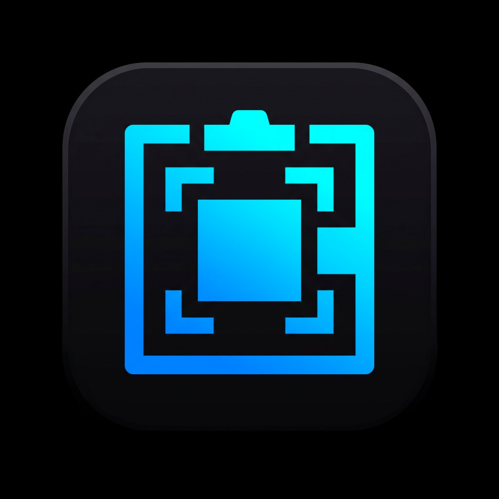

# SnipClip

A private desktop clipboard history, screenshot editor, and screen recorder that stays out of the way until you need it.

<p align="center">
  
</p>

<p align="center">
  
</p>

<p align="center">
  <strong><a href="https://github.com/Ander507/SnipClip/releases/latest">Download the latest release</a></strong>
</p>

## Quick start

1. Download the installer or portable build from the [latest release](https://github.com/Ander507/SnipClip/releases/latest).
2. Open SnipClip. It will keep running in the system tray.
3. Press `Ctrl+Shift+V` for the vault, `Ctrl+Shift+S` for a snip, or `Ctrl+Shift+R` to record.

The vault, snip, and record shortcuts can all be changed in Settings. Press `Alt+C` to open the quick clipboard palette from anywhere.

## Features

- **Clipboard vault** — keeps searchable history for text, links, code, and images in a local SQLite database.
- **Fast paste palette** — press `Alt+C`, search recent items, and copy one without opening the full app.
- **Screenshots and annotation** — capture a region, then draw, highlight, blur, add arrows or callouts, pick colors, zoom, and pan.
- **Screen recording** — record any region as MP4 or GIF at a smooth adaptive frame rate, with optional Windows desktop audio.
- **OCR and smart previews** — copy text from images on Windows and get readable previews for code, JSON, links, and colors.
- **History controls** — pin important items, edit text, pause monitoring, ignore selected apps, or clear old unpinned history automatically.
- **Made to live in the tray** — configurable global shortcuts, launch at login, signed updates, and custom themes without a window in your way.

<p align="center">
  
  
</p>

## Run it locally

You will need:

- [Node.js 20+](https://nodejs.org/)
- Stable [Rust](https://rustup.rs/)
- The [Tauri 2 prerequisites](https://v2.tauri.app/start/prerequisites/) for your operating system
- On Wayland: `grim`, `slurp`, and `wl-clipboard`

```bash
git clone https://github.com/Ander507/SnipClip.git && cd SnipClip
npm install
npm run tauri dev
```

Use `npm run tauri build` to create a production package. No environment variables or external database are required. FFmpeg is resolved automatically for recording, and SnipClip stores its vault in the operating system's app-data directory.

Windows is the primary target and has the complete feature set, including desktop-audio recording and OCR. Linux supports the core vault and capture flow, with the tools above required on Wayland. Prebuilt macOS packages are not currently published, but the app can be built from source.

## How it works

SnipClip uses Tauri 2 to keep the interface small while moving the system-facing work into Rust. Clipboard history is persisted locally with SQLite, and long histories stay responsive because the React list is virtualized and only loads full images when they are opened.

Screenshots use a preloaded transparent overlay, so invoking a snip does not have to boot a new window. The overlay disappears before the desktop is captured, which keeps SnipClip itself out of the image. Annotations are rendered in image-pixel space on an HTML canvas, so zooming does not change the final result or weaken a blur.

On Windows, recording captures only the selected rectangle into a reusable BGRA buffer instead of copying the whole monitor every frame. A fixed-rate FFmpeg pipeline keeps the video timeline in sync with real time, and optional desktop audio is captured through WASAPI before being muxed into the final MP4.

## Credits

SnipClip is built with [Tauri](https://tauri.app/), [React](https://react.dev/), [Tailwind CSS](https://tailwindcss.com/), [rusqlite](https://github.com/rusqlite/rusqlite), [arboard](https://github.com/1Password/arboard), [xcap](https://github.com/nashaofu/xcap), [FFmpeg](https://ffmpeg.org/), and [Lucide](https://lucide.dev/).

If it saves you time, you can [buy me a white Monster](https://ko-fi.com/ander507).
