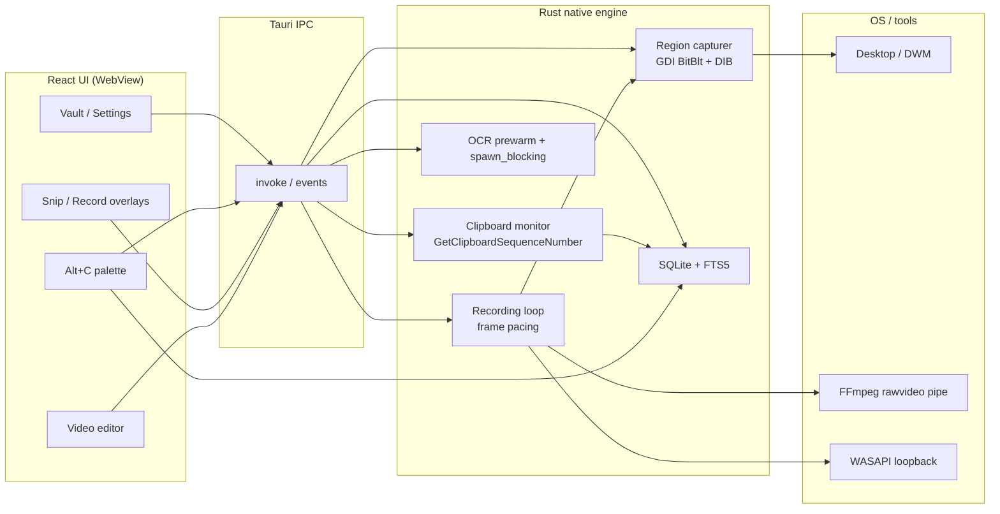

# SnipClip

A tray app for clipboard history, screenshots, screen recording, OCR, and in-app video trim. Private, local, and fast.

> **Win+V is shit.** Windows 11 ships a clipboard history called `Win+V`. It caps at ~25 items, syncs to your Microsoft account, and shows only plain text and images. No search, no categories, no OCR, no screenshots, no recording, no editor, no command palette. SnipClip is the answer: a full capture studio that stays local, with none of that.

<p align="center">
  
</p>

<p align="center">
  
</p>

<p align="center">
  <a href="https://github.com/Ander507/SnipClip/releases/latest"></a>
</p>

<p align="center">
  <strong><a href="https://github.com/Ander507/SnipClip/releases/latest">Download the latest release</a></strong><br/>
  Windows: NSIS <code>.exe</code> · MSI · portable <code>.zip</code><br/>
  Linux: <code>.AppImage</code> · <code>.deb</code>
</p>

> **Reviewers:** you do not need to build from source. Grab a prebuilt installer from [Releases](https://github.com/Ander507/SnipClip/releases/latest), install, then use the shortcuts below. Multi-monitor snip/record is supported.

## Try it in 60 seconds

1. [Download](https://github.com/Ander507/SnipClip/releases/latest) and run the installer (or unzip the portable build).
2. SnipClip sits in the system tray - no window until you need it.
3. Copy something (text, a link, or an image). Press **`Ctrl+Shift+V`** to open the vault and see it saved.
4. Press **`Alt+C`** anywhere to search recent clips and paste one without opening the full app.
5. Press **`Ctrl+Shift+S`** to snip a region on **any monitor**, annotate, and save to the vault.
6. Press **`Ctrl+Shift+R`** to record a region as MP4 or GIF, then trim/crop/mute in the built-in video editor.

All shortcuts are configurable in Settings. If one is already taken by Windows (Win+V, Snipping Tool, Game Bar, etc.), SnipClip tells you instead of failing silently.

## Why SnipClip? (vs. Windows 11 Win+V)

Windows 11 ships a clipboard history (`Win+V`). It's a 25-item, cloud-synced, plain-text-and-images-only tray. SnipClip is what Win+V should have been: a full capture studio that stays local.

| Windows 11 `Win+V` | SnipClip |
|---|---|
| ~25 item cap, then it forgets | **Unlimited** local SQLite vault |
| Cloud sync (Microsoft account) | **Local only** - your data stays on your machine |
| Plain text + images | Text, links, code, math, images, screenshots, recordings |
| No search | **FTS5 search** + `Alt+C` quick-paste palette |
| No categories | All, Text, Images, Screenshots, Videos, Links, Pinned - **reorder/hide** in Settings |
| No pinning beyond the cap | **Pin anything**, forever |
| No OCR | **Copy text from any image** (native Windows Media OCR, no bundled models) |
| Full-screen snips only | **Multi-monitor** region capture + draw, blur, arrows, callouts |
| No recording | Region **MP4/GIF** + in-app trim/crop/mute + optional WASAPI desktop audio |
| No editor | **In-app video editor** - trim, crop, mute, MP4↔GIF |
| One theme | **Custom theme packs** + glassmorphic surfaces |
| Slow to open | **Tray-first**, instant hotkeys, signed auto-updates |
| No ignore list | **Skip copies** from WhisperFlow, 1Password, Edge, etc. |
| No auto-clear | **Schedule purge** of unpinned history (never / reboot / daily / weekly) |
| No command palette | **`Alt+C`** quick paste over any app |
| No math | **Auto-solve** copied arithmetic and swap the clipboard for the answer |
| No encryption | **Password-protected vault** (AES-256-GCM at rest, Argon2id key) |

Everything in SnipClip runs locally in Rust: no cloud, no account, no telemetry. Win+V syncs your clipboard to Microsoft. SnipClip keeps yours on your machine.

## Keyboard shortcuts

| Action | Shortcut |
|---|---|
| Open vault | `Ctrl+Shift+V` |
| Quick paste palette | `Alt+C` |
| Snip region | `Ctrl+Shift+S` |
| Record region | `Ctrl+Shift+R` |

Inside the vault: `↑↓` navigate, `Enter` copy, `P` pin, `Delete` remove, `1`-`7` switch tab

## Features

- **Clipboard vault + `Alt+C` palette**: searchable history for text, links, code, math, images, and recordings in local SQLite. `Alt+C` opens a lightweight FTS5-powered search window so you can paste a clip without leaving the app you're in.
- **Multi-monitor capture + annotation**: one overlay per display; physical coordinates handle negative desktop origins, so a secondary screen with a negative position still crops correctly. Draw, highlight, blur, arrows, callouts. The overlay hides and parks off-screen before capture, then waits ~150 ms so DWM flushes the compositor. No translucent UI baked into the shot.
- **Screen recording + in-app trim**: region MP4/GIF with optional Windows desktop audio, then in-app trim/crop/mute/export. Simple MP4 trims use stream-copy for near-instant cuts.
- **OCR + math auto-solve**: copy text from any image using the built-in Windows Media OCR engine (no bundled model, so the binary stays small). Copy arithmetic and SnipClip evaluates it, puts the answer on your clipboard, and saves the line in the vault. `2×3÷4` becomes `6`.
- **Customizable sidebar + keyboard shortcuts**: reorder or hide library tabs (All, Text, Images, Screenshots, Videos, Links, Pinned) in Settings. `1`-`7` switch tabs, `↑↓` move, `Enter` copy, `P` pin, `Delete` remove.
- **Password-protected vault + backup**: lock the vault with a password and it's encrypted at rest with AES-256-GCM. Lose the password and it's gone; there is no recovery. Export the vault to a file, or restore one (applies on next launch).
- **Tray-first**: global shortcuts, launch at login, signed updates, custom themes.

<p align="center">
  
  
</p>

## Technical architecture

SnipClip is not a thin React wrapper. The UI is a small WebView; the heavy lifting (capture, clipboard, encoding, OCR, storage) runs in Rust. The React frontend just paints and invokes commands.

I picked Tauri 2 and Rust over Electron because Electron drags a full Chromium and a Node runtime into every app, and a clipboard manager built on it ends up eating hundreds of MB of RAM. Tauri uses the OS WebView (WebView2 on Windows, WebKit on macOS and Linux) and does the native work in-process Rust, so the tray stays small and the capture threads are short-lived. The tradeoff is platform work: GDI, WASAPI, and the Windows Media OCR API are Windows-only. That's where the users are, and the Rust side already handles the vault and the UI cross-platform.

I went with local SQLite and no cloud. Win+V syncs your clipboard to your Microsoft account. SnipClip keeps yours in a local WAL SQLite database under your OS app-data directory, with FTS5 for search. Nothing leaves the machine: no cloud, no account, no telemetry.

### Why Tauri + Rust (not Electron)

| | Electron | SnipClip (Tauri 2) |
|---|---|---|
| Runtime | Full Chromium + Node | OS WebView2 / WebKit |
| Native work | Node addons / child processes | In-process Rust |
| IPC | JSON over bridges | Generated Tauri commands (typed, low overhead) |
| Typical footprint | Hundreds of MB RAM | Small tray resident + short-lived capture threads |

System work (GDI blit, WASAPI, FFmpeg stdin, SQLite) never crosses a Node process boundary.

### Architecture diagram



### Desktop capture (Windows)

SnipClip does not grab the entire monitor and crop. On Windows, `RegionCapturer` allocates a region-sized top-down BGRA DIB and blits only that rectangle with GDI `BitBlt` + `CAPTUREBLT` (layered windows / menus). The same path feeds snips and the recording encoder.

Before a still capture, overlays are hidden and parked off-screen, then the pipeline waits ~150 ms so the Desktop Window Manager flushes the compositor buffer. That stops the translucent snip UI from baking into the shot.

`available_monitors()` drives one overlay window per display, positioned at each monitor's physical origin. Selection math uses `outerPosition` / scale factor (and the emitted desktop origin) so secondary screens with negative coordinates still crop correctly. Capture stitches or GDI-blits in absolute desktop space.

### FFmpeg rawvideo pipeline

Recording spawns FFmpeg with stdin as a raw BGRA source (`-f rawvideo -pixel_format bgra -i -`). Frames are written on a fixed wall-clock interval so the MP4 timeline stays 1:1 with real time even when the screen is static (stale frame replay) or the encoder stalls (resync instead of catch-up bursts).

Crash-safe buffer management:

- Capture thread to shared frame slot to encoder thread (no unbounded queue growth).
- Exact frame byte checks before `write_all` on stdin.
- Stop path drops stdin (EOF), waits for FFmpeg to finalize the container, then verifies a non-empty file.
- Abort path kills the child and deletes partial output.
- Optional WASAPI loopback audio is muxed in a second FFmpeg pass (`-c:v copy` + AAC).

Post-record, the in-app editor runs trim/crop/mute/GIF via `process_video_clip`. Simple MP4 trims use `-c copy` (or `-c:v copy -an`) for near-instant cuts.

### SQLite vault + FTS5

History lives in a local WAL SQLite database under the OS app-data directory.

- Row indexes on `created_at`, `is_pinned`, and `content_type` for vault browsing.
- `items_fts` (FTS5) indexes text/link bodies (and recording previews) for the `Alt+C` palette. Prefix queries (`term*`) with a LIKE fallback for punctuation-only input.
- List queries omit heavy image blobs; previews carry small thumbnails.
- Insert path trims unpinned history and keeps the FTS table in sync.

### Responsiveness

- Virtualized vault list for long histories.
- Snipper webviews stay warm and hidden so the first hotkey is instant.
- OCR models prewarm on a background thread; recognition runs in `spawn_blocking`.
- Hotkey registration and auto-clear do not tear down the tray if they fail.

## Downloads & releases

Published by [`.github/workflows/release.yml`](./.github/workflows/release.yml) on version tags (`v*`):

| Platform | Artifacts |
|---|---|
| **Windows** | Signed updater metadata + **NSIS `.exe`**, **`.msi`**, and **portable `.zip`** (`SnipClip.exe`, no install) |
| **Linux** | **`.AppImage`** and **`.deb`** |
| **macOS** | Build from source today (no prebuilt `.dmg` in CI yet) |

Windows needs WebView2 (already present on most Windows 10/11 PCs). Auto-updates use `latest.json` from the GitHub release (installer builds).

## Run it locally

Requirements:

- [Node.js 20+](https://nodejs.org/)
- Stable [Rust](https://rustup.rs/)
- [Tauri 2 prerequisites](https://v2.tauri.app/start/prerequisites/) for your OS
- On Wayland Linux: `grim`, `slurp`, and `wl-clipboard`

```bash
git clone https://github.com/Ander507/SnipClip.git && cd SnipClip
npm install
npm run tauri dev
```

Production build: `npm run tauri build`

No environment variables or external database. FFmpeg is resolved/bundled via `ffmpeg-sidecar` for recording. The vault lives in your OS app-data directory.

**Platform notes:** Windows has the full feature set (desktop-audio recording, OCR, GDI capture, multi-monitor overlays). Linux supports vault + capture on Wayland with the tools above.

See [CHANGELOG.md](./CHANGELOG.md) for version history.

## Credits

Built with [Tauri](https://tauri.app/), [React](https://react.dev/), [Tailwind CSS](https://tailwindcss.com/), [rusqlite](https://github.com/rusqlite/rusqlite), [arboard](https://github.com/1Password/arboard), [xcap](https://github.com/nashaofu/xcap), [FFmpeg](https://ffmpeg.org/), and [Lucide](https://lucide.dev/).

If SnipClip saves you time, you can [buy me a white Monster](https://ko-fi.com/ander507).
