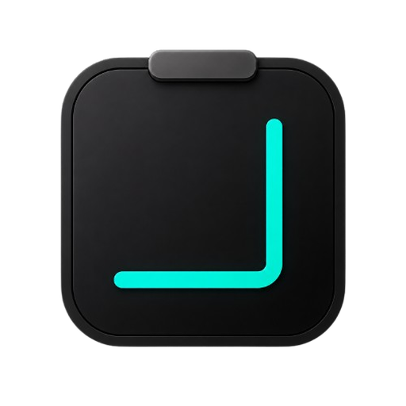

# SnipClip

A local desktop clipboard vault and screenshot snipper — copy history, annotate captures, stay in the tray.

<p align="center">
  
</p>

> **Try it:** [Download the latest Windows release](https://github.com/Ander507/SnipClip/releases/latest) (`.msi` installer or standalone `.exe`), or build from source below.

## Download

1. Open **[Releases](https://github.com/Ander507/SnipClip/releases)**
2. Grab `SnipClip_…_x64_en-US.msi` (installer) or the standalone `.exe`
3. Install / run — SnipClip lives in the tray; `Ctrl+Shift+V` toggles the UI, `Ctrl+Shift+S` snips

## Quick start (from source)

```bash
npm install
npm run tauri dev
```

That’s it for day-to-day use. First launch may compile the Rust side — give it a minute.

**Defaults**

| Shortcut | Action |
|----------|--------|
| `Ctrl+Shift+V` | Toggle clipboard vault |
| `Ctrl+Shift+S` | Start region snip |

Both are editable in Settings.

## Features

- **Clipboard vault** — watches the system clipboard for text, links, and images; stores history in SQLite (pinned items stay safe)
- **Search & filters** — All / Text / Images / Links / Pinned, instant search, ↑↓ / `j` `k` keyboard nav
- **Region snip** — translucent overlay → crop → annotate (pen, arrow, rect, highlight, blur, callouts, color picker)
- **Re-edit from vault** — open a past screenshot and annotate again
- **Zoom & pan** — wheel zoom centered on cursor; middle-click or Shift-drag to pan
- **Auto-clear** — optional wipe of unpinned history on reboot / daily / weekly
- **Tray app** — close hides to tray; global hotkeys work while you’re in other apps
- **Launch at startup** — optional login autostart; boots minimized to tray until you hit a hotkey

## Run locally

**Needs**

- [Node.js](https://nodejs.org/) 20+ (npm)
- [Rust](https://rustup.rs/) (stable) + Tauri Windows prerequisites ([guide](https://v2.tauri.app/start/prerequisites/))
- Windows 10/11 (primary target; uses `xcap` for capture)

```bash
# Install deps
npm install

# Dev (Vite + Tauri)
npm run tauri dev

# Production installer / exe
npm run tauri build
```

No `.env` required for the default local vault. Data lives under the app data directory (`snipclip.db`).

### Vault keyboard shortcuts

| Key | Action |
|-----|--------|
| `↑` / `↓` or `j` / `k` | Navigate |
| `Enter` | Copy selected |
| `p` | Toggle pin |
| `Delete` / `Backspace` | Remove item |
| `/` | Focus search |
| `Esc` | Clear search / leave snip |

## How it works

SnipClip is a **Tauri 2** shell: React + Tailwind UI, Rust for clipboard monitoring (`arboard`), screen capture (`xcap`), SQLite (`rusqlite`), and global hotkeys.

The snipper is a **second, preloaded transparent window** kept warm at startup. On hotkey it shows instantly over the desktop; after you drag a region it hides, captures that rect, then hands the crop to the annotation editor in the main window. That avoids baking the overlay UI into the screenshot.

Annotations (including blur) run on an **HTML canvas in image-pixel space**, so zoom/pan don’t weaken redaction. The vault list is virtualized so long histories stay light — image rows keep thumbnails; full blobs load only for preview / re-edit.

## Credits

Built with [Tauri](https://tauri.app/), [React](https://react.dev/), [Tailwind CSS](https://tailwindcss.com/), [rusqlite](https://github.com/rusqlite/rusqlite), [arboard](https://github.com/1Password/arboard), [xcap](https://github.com/nashaofu/xcap), and [Lucide](https://lucide.dev/).
